# WhatsNewView
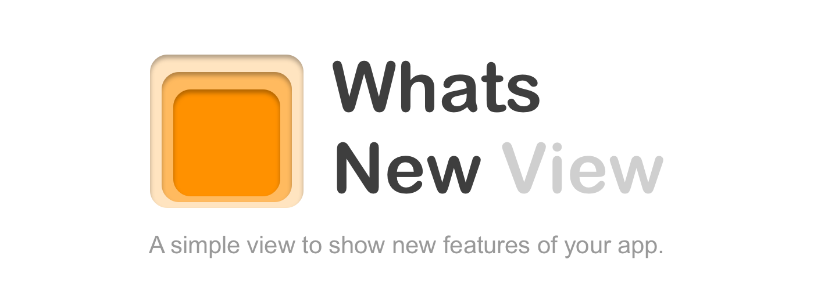


**WhatsNewView** is an elegant, quick and simple way to present new features of your app to your user. The Swift-Package is written in Swift using SwiftUI. It uses plist-files or code for the configuration of the view. It works on all screen-sizes, in portrait and landscape mode and supports SF Symbols 💯, dark mode and dynamic fonts (accessible resizable fonts).

## What **WhatsNewView** can do for your app

1. Inform about new features in new versions. The view will be presented every time there is a new version of your app. Kind of **like a changelog nicely designed for your users**.
2. Show a sleek screen to inform your users about something in your app like instructions, news or how your app manages data.

### Examples for new versions

| iPhone 12 Pro Max | iPhone 12 Pro | iPhone SE |
| --- | --- | --- |
| 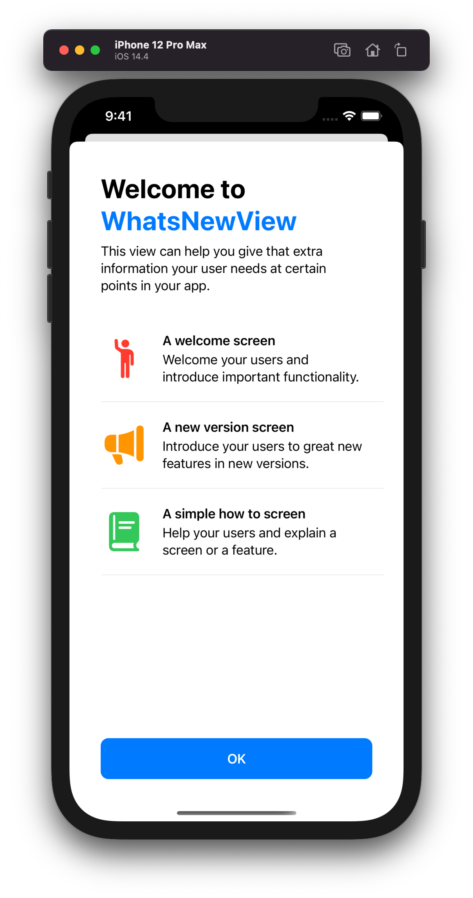 | 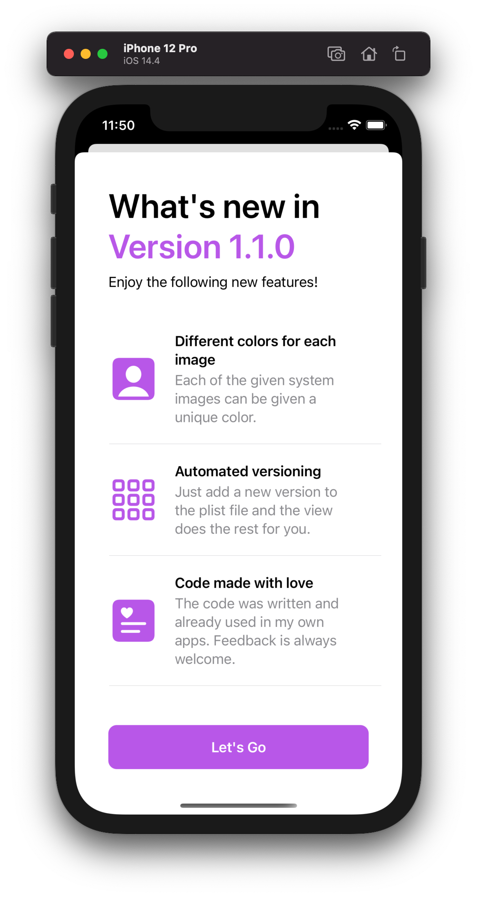 | 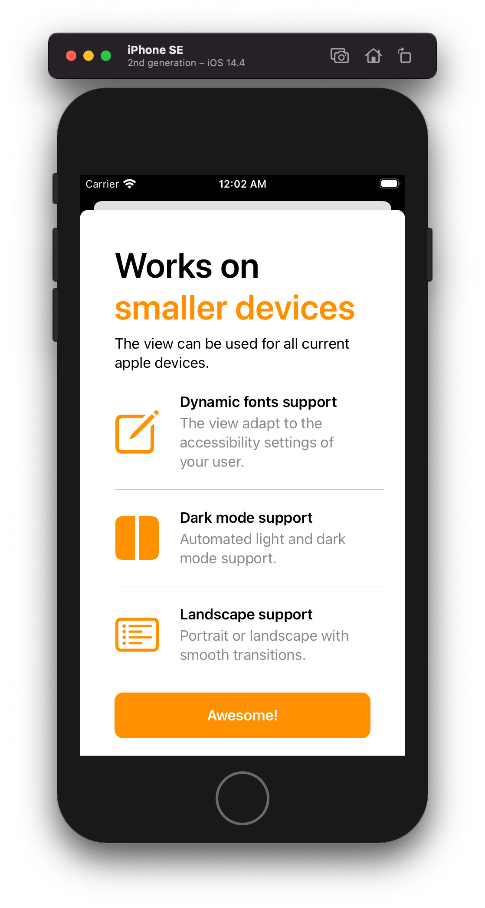 |

### Examples to show informations (insprired by Apple Apps)

| Landing Page (Connect App) | Instructions (Health App) | Plain textual information |
| --- | --- | --- |
| 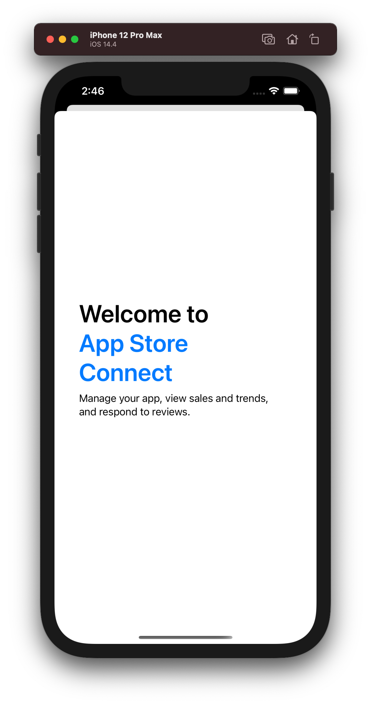 | 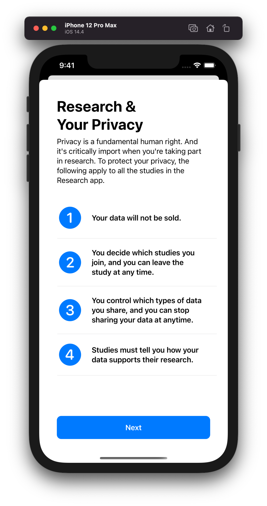 | 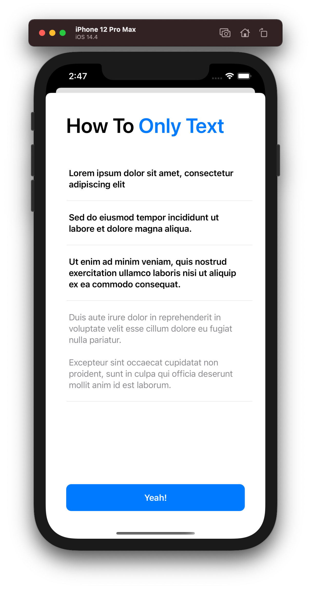 |

Any element of the screen can be omitted and the view will behave accordingly so you don't have to take care of that.

## Installation
### Swift Package Manager (SPM)
`.package(url: "https://github.com/kevenbauke/WhatsNewView.git", from: "1.0.0")`


## Usage

The **WhatsNewView** can be configured three ways:
1. **Versioning:** With a .plist file to show it for each version of your app. This presents a optional welcome screen and and a version screen every time you change the version of the app.
2. **Configuration via a plist-file:** With a .plist file for simple configuration.
3. **Configuration via code:** With a configuration object by code.

### 1. Versioning - Show different versions

The easiest way to use **WhatsNewView**. It is used to welcome your user and show new features for each version. You only need to create a plist with the name `WhatsNewVersion.plist` and change it for each version. An example plist can be found [here](WhatsNewViewExample/Shared/Ressources/WhatsNewVersion.plist).

#### SwiftUI

```swift
// This looks for the WhatsNewVersion.plist in your main bundle and creates the view for you.
let whatsNewView = try? WhatsNewView()
```

You can also set a specific path for your own configuration plist using a dedicated initialiser:
```swift
let whatsNewView = try? WhatsNewView(versionPlistPath: path)
```

#### UIKit

```swift
let controller = try? WhatsNewViewController(versionPlistPath: path)
```

The versioning is all automated. The user initially gets greeted with a welcome view and all other time with a version view. You simply have to put a new entry for each version into the version plist. Whenever the **WhatsNewView** is created it looks for the version in the plist and reads the content from that version. If **WhatsNewView** for the version was shown already, the initialiser will return nil so you know you don't need to present it.

More information about how to setup the version plist and the versioning can be found [here]().

### 2. Configuration Plist-File - Content from a Plist
There is a specific initialiser to configure the WhatsNewView with a configuration plist-file:

```swift
let whatsNewView = try? WhatsNewView(configurationPlistPath: path)
```

An example configuration file can be found [here](WhatsNewViewExample/Shared/Ressources/WhatsNewConfiguration.plist). More information about the creation of the configuration plist can be found [here]().

### 3. Configuration Plist-Object - Content from a configuration object

Of course you can use code as well with the help of a `WhatsNewConfiguration` object.

```swift
let configuration = WhatsNewConfiguration()
let whatsNewView = WhatsNewView(configuration: configuration)
```

More information about the configuration object can be found [here]().

### Displaying the view

You can use the view as any other view. The usual case would be to present it as a sheet.

#### When a condition was met

```swift
@State var shouldPresentWhatsNewView = true

// Shows the view whenever you change shouldPresentWhatsNewView to true.
ContentView()
  .sheet(isPresented: $shouldPresentWhatsNewView) {
    try? WhatsNewView()
  }
```

#### On appearance of a view

```swift
@State var whatsNewView: WhatsNewView?

// Shows the sheet every time the ContentView is shown.
ContentView()
  .sheet(item: $whatsNewView) { $0 }
  .onAppear {
    whatsNewView = try? WhatsNewView()
  }
```

#### UIKit
```swift
guard let path = Bundle.main.path(forResource: "WhatsNewVersion", ofType: "plist") else { return }

if let whatsNewViewController = try? WhatsNewViewController(versionPlistPath: path) {
	presentingController?.present(whatsNewViewController, animated: true)
}
```

## Structure of the plists
| Configuration-Plist-Structure | Screen result |
| --- | --- |
| 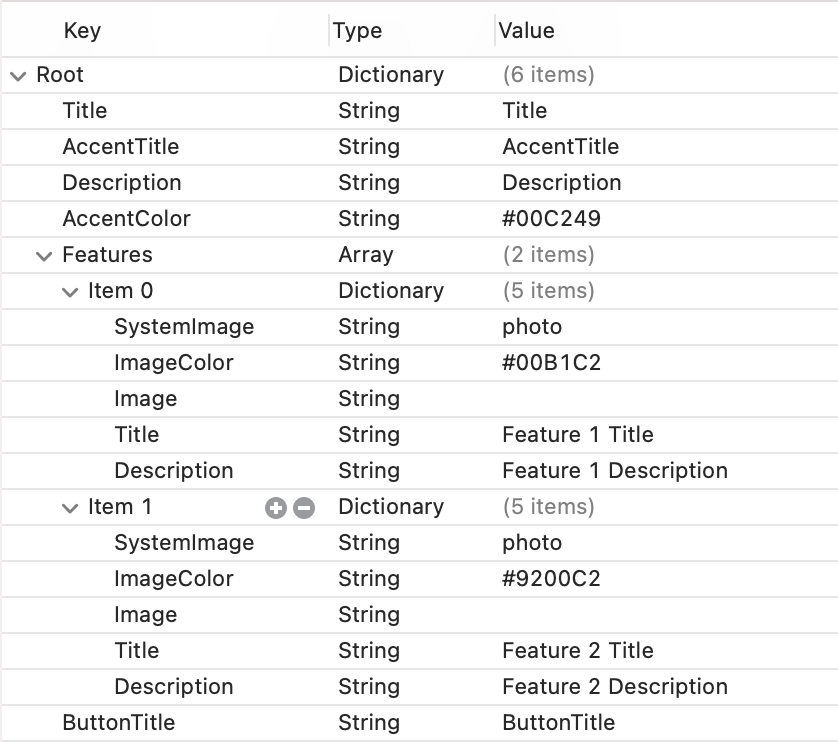 | 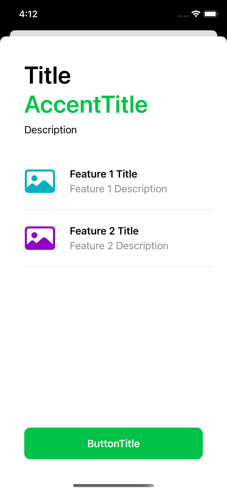 |

| Version-Plist-Structure | Screen result |
| --- | --- |
| 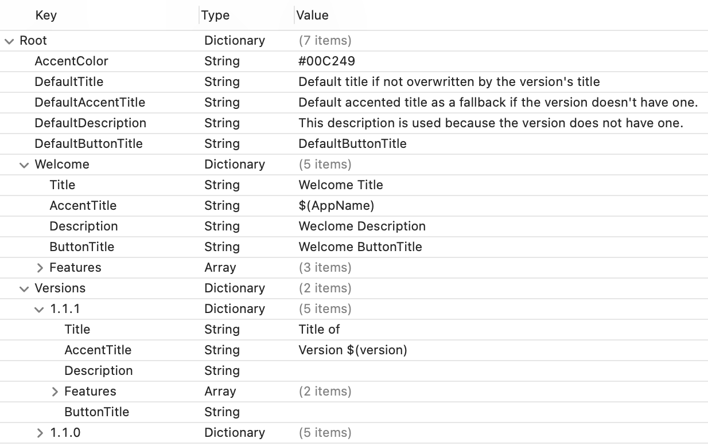 | 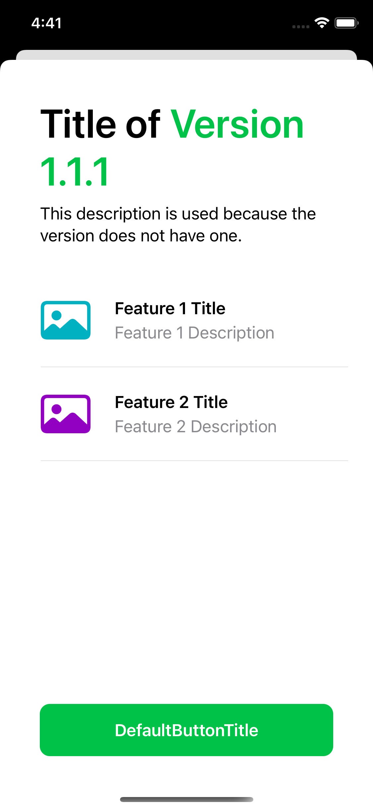 |
| The defaults in the beginning are always used in case the versions don't have the respective key configured. The Welcome Dictionary is used at the initial start of the app (remove it if you want to show the versions only) otherwise the Version is used if present. Basically the Welcome and each Version Dictionary contains one Configuration Plist as seen above. **You can use the variables $(AppName) und $(Version) to show the name or the version of your app.** |

## Catching errors
Except of the last, all initialisers are failable and throwing. That's why a `try?` was used in front of the initialisers. They throw a `WhatsNewView.InitError`. This helps to find problems while creating the **WhatsNewView**. A proper way of initialising the **WhatsNewView** would be with a do-catch statement:

```
do {
  let whatsNewView = try WhatsNewView(configurationPlistPath: path)
} catch {
  print("Something went wrong while initialising the WhatsNewView. Error: \(error.localizedDescription).")
}
```

## Debugging functions

There are currently two functions in case you want to change the version saved in the framework:
1. `WhatsNewView.resetVersion()` - resets last known version saved.
2. `WhatsNewView.setLastKnownVersion(version: String)` - lets you set a specific version. The version has to be [semantic](https://semver.org) e.g. `"1.3.2"`.

## Examples

All these example can also be found in the [examples app](WhatsNewViewExample).

To fully automate the process, you can use this code for a `@main`. This shows the view whenever the `ContentView` is presented in the app.

```swift
import SwiftUI
import WhatsNewView

@main
struct WhatsNewViewExampleApp: App {
	@State var whatsNewView: WhatsNewView?

    var body: some Scene {
        WindowGroup {
            ContentView()
              .sheet(item: $whatsNewView) { $0 }
              .onAppear {
                whatsNewView = try? WhatsNewView()
              }
        }
    }
}
```
